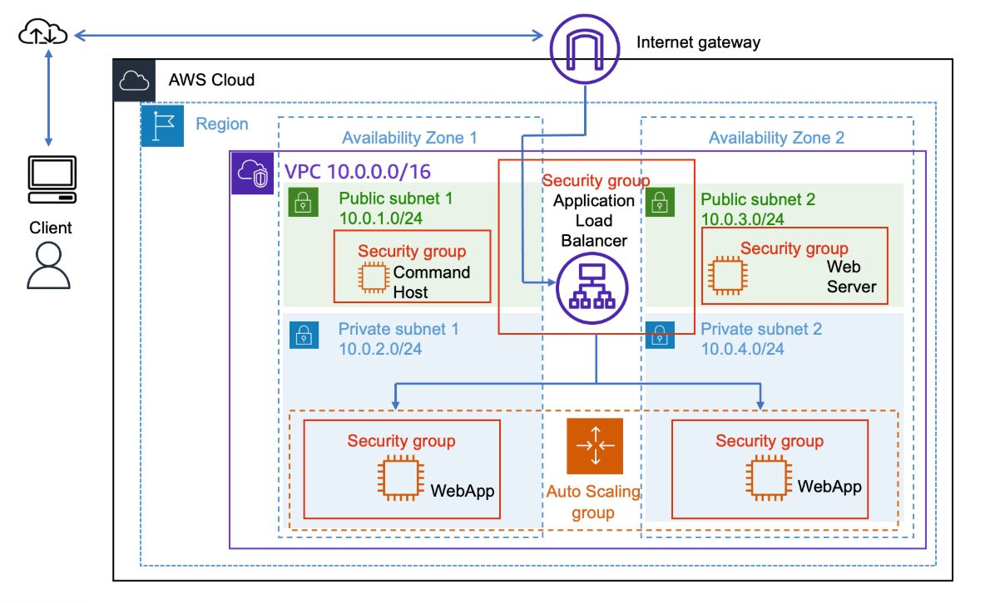
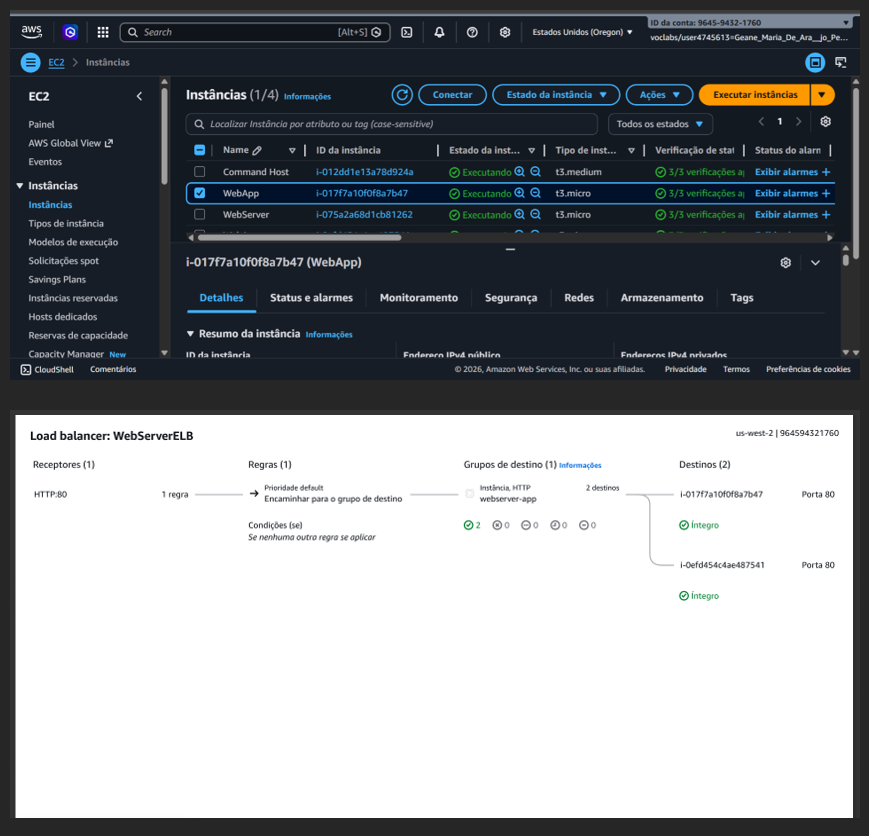

# Arquitetura Elástica na AWS: Autoescalonamento e Balanceamento de Carga

## 📋 Sobre o Projeto
Este projeto demonstra a implementação de uma infraestrutura em nuvem na AWS capaz de se adaptar automaticamente a variações de tráfego. O objetivo principal foi garantir que a aplicação permanecesse disponível e performática mesmo sob alta carga de processamento.

## 🏗️ Arquitetura
A solução foi desenhada seguindo as melhores práticas de alta disponibilidade, distribuindo recursos em múltiplas Zonas de Disponibilidade (AZs).

*(Referência da infraestrutura planejada)*

## 🚀 Tecnologias e Serviços Utilizados
* **Amazon EC2**: Instâncias Linux para hospedar o servidor web.
* **AWS CLI**: Utilizada para automação, criação de instâncias e manipulação de AMIs.
* **Application Load Balancer (ALB)**: Responsável por distribuir o tráfego de entrada entre as instâncias saudáveis.
* **Auto Scaling Group**: Configurado para gerir o ciclo de vida das instâncias, com capacidade de variar entre 2 e 4 servidores conforme a demanda.
* **Amazon CloudWatch**: Utilizado para monitorizar métricas de CPU e disparar os alarmes de escalonamento.

## 🛠️ Implementação Realizada

1.  **Criação da Imagem Base (AMI)**: Através da AWS CLI, foi configurada uma instância padrão e criada uma Amazon Machine Image (AMI) para servir de template.
2.  **Configuração do Load Balancer**: Implementação do ALB e definição dos Target Groups. O sistema foi validado com o status **"Integro"**, confirmando o direcionamento correto do tráfego.
3.  **Teste de Stress e Monitoramento**: Execução de um script de carga para validar o nascimento de novas instâncias em tempo real ao ultrapassar 50% de uso de CPU.

## 📈 Resultados e Monitoramento
Abaixo, a evidência do painel de monitoramento durante a execução do projeto:

*(Status do Auto Scaling e métricas de saúde das instâncias)*
